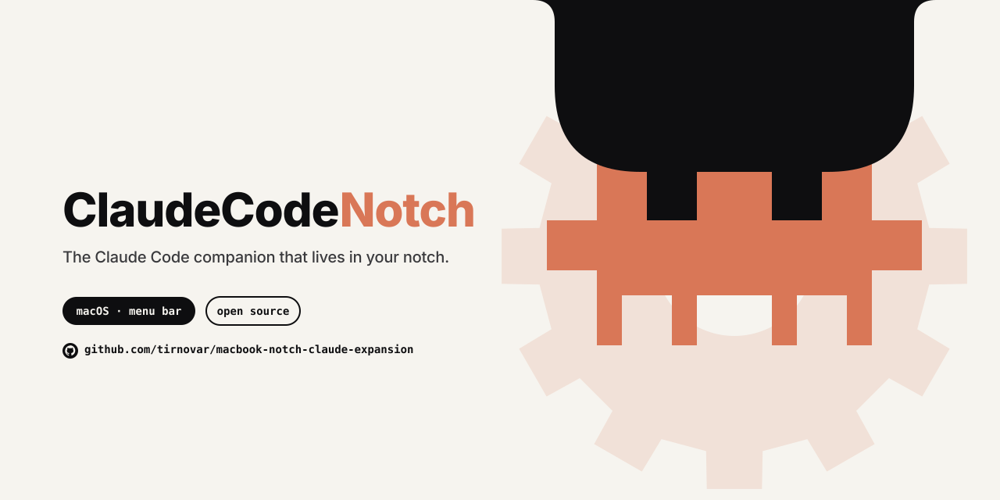

# Claude Notch


**Turn the MacBook notch into a live Claude Code monitor and permission UI — no Dock icon, no window switching.**

---

## The problem

Claude Code runs in the terminal, but approvals and session status live there too. Switching focus to check whether a tool call is waiting for permission, or whether a long job is still running, breaks flow — especially across multiple concurrent sessions.

Claude Notch moves all of that into the one piece of screen real estate that's always visible and otherwise wasted: the hardware notch.

## Session monitor

The notch silently expands to show session state. You stay in your editor.

<!-- SCREENSHOT: notch with single amber dot (active session) -->
<!--  -->

<!-- SCREENSHOT: notch with pill showing "2" (multiple sessions) -->
<!--  -->

| Indicator | Meaning |
|---|---|
| Amber dot (pulsing) | At least one session is working or waiting for permission |
| Green dot (static) | All sessions finished recently |
| Gray dot (static) | All sessions are idle |

**One session** → dot. **Two or more** → the dot spring-animates into a pill with a session count. When it drops back to one, the pill shrinks back. Click anywhere on the bar to open the detail panel — each row shows session state, entrypoint icon, and focuses the right terminal or editor on click.

## Permission card

When Claude Code needs approval for a tool call, the notch expands downward into a card. No terminal hunting required.

<!-- SCREENSHOT: permission card expanded in the notch — show tool name, command preview, and the four buttons -->
<!--  -->

| Button | Effect |
|---|---|
| **Accept Once** | Allows this one call |
| **For Session** | Allows the same tool pattern for the rest of this session |
| **Permanently** | Writes the pattern to `~/.claude/settings.json` |
| **Decline** | Blocks the call |

No response after 90 seconds → automatic allow. Claude Code never gets stuck waiting.

## Installation

### Download (recommended)

1. Go to [Releases](../../releases) and download `ClaudeNotchExpansion.app.zip`
2. Unzip → move `ClaudeNotchExpansion.app` to `/Applications/`
3. Launch the app

On first launch the app:
- Registers a `PreToolUse` hook in `~/.claude/settings.json`
- Installs a LaunchAgent (`KeepAlive=true`) so it starts at login and restarts after crashes

If you move the `.app` later, the hook and LaunchAgent paths update automatically on next launch.

### Build from source

**Requirements:** macOS 14.0+, Swift 5.10+, Python 3

```bash
git clone <repo>
cd macbook-notch-claude-expansion
make app
cp -r .build/ClaudeNotchExpansion.app /Applications/
open /Applications/ClaudeNotchExpansion.app
```

## Testing without a live Claude Code session

```bash
# Simulate a permission request (app must be running)
make test-hook

# Fake session file so the status bar appears; Ctrl+C removes it
make test-session
```

## Architecture

```
~/.claude/sessions/{pid}.json  ──FSEvents──►  SessionMonitor (actor)
                                                    │
~/.claude/settings.json ─auto hook install─►  HookInstaller
                                                    │
PreToolUse hook (Python) ──Unix socket──►  PermissionServer (actor)
                                                    │
                                          AppState (@MainActor)
                                                    │
                                       NotchWindowController (NSWindow)
                                                    │
                                            SwiftUI Views
```

**IPC:** Unix domain socket `/tmp/claude-notch-monitor.sock`, 4-byte big-endian length-prefixed JSON. One request per connection, hook blocks until the app responds.

**Session detection:** FSEvents on `~/.claude/sessions/`. Each Claude Code process writes `{pid}.json`. Liveness validated via `kill(pid, 0)`, rechecked every 30 s.

**Permission cache (three levels):**
- *Accept Once* — no cache
- *For Session* — in-process dict + `/tmp/claude-notch-session-{id}.json`
- *Permanently* — atomic write to `~/.claude/settings.json → permissions.allow`

## How the hook works

`claude-notch-hook.py` is a synchronous `PreToolUse` hook. Claude Code calls it before every tool use and blocks on the response.

1. App bundle gone → self-removes hook entry and exits
2. Checks `permissions.allow` across all settings layers → fast exit if already allowed
3. Checks session cache → fast exit if already approved this session
4. Connects to the Unix socket; if app is not running, launches via `open -g` and polls (up to 3 s)
5. Blocks waiting for UI response (up to 90 s)
6. Timeout → allow

## Requirements

- macOS 14.0 (Sonoma) or later
- MacBook with hardware notch
- Python 3 (ships with macOS, used for the hook script)
- Swift 5.10+ (build from source only)

## Bundle identifier

`cz.databrothers.claude-notch-expansion`
